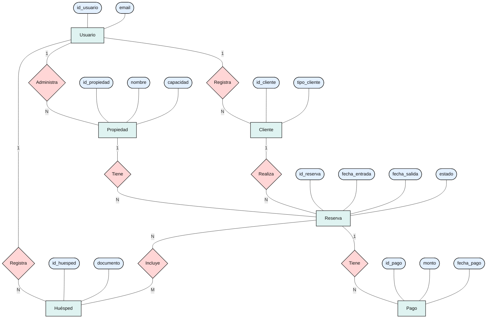

# Diagrama Entidad-Relación

El siguiente diagrama representa el modelo conceptual de datos de Alquify. Se incluyen las entidades principales, algunos de sus atributos más relevantes y las relaciones existentes entre ellas junto con sus respectivas cardinalidades.

## Relaciones representadas

- Usuario **1:N** Propiedad.
- Usuario **1:N** Cliente.
- Usuario **1:N** Huésped.
- Propiedad **1:N** Reserva.
- Cliente **1:N** Reserva.
- Reserva **N:M** Huésped.
- Reserva **1:N** Pago.

La relación muchos a muchos entre Reserva y Huésped será implementada en el esquema relacional mediante la tabla asociativa `reserva_huesped`.
