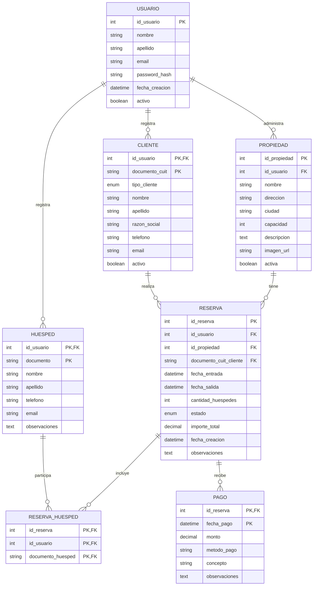

# Diagrama Entidad-Relación

El siguiente diagrama representa el modelo de datos de Alquify. Se incluyen las entidades del sistema, sus atributos, claves primarias y foráneas, y las relaciones existentes entre ellas junto con sus respectivas cardinalidades.

```mermaid
erDiagram

    USUARIO {
        int id_usuario PK
        string nombre
        string apellido
        string email
        string password_hash
        datetime fecha_creacion
        boolean activo
    }

    PROPIEDAD {
        int id_propiedad PK
        int id_usuario FK
        string nombre
        string direccion
        string ciudad
        int capacidad
        text descripcion
        string imagen_url
        boolean activa
    }

    CLIENTE {
        int id_usuario PK, FK
        string documento_cuit PK
        enum tipo_cliente
        string nombre
        string apellido
        string razon_social
        string telefono
        string email
        boolean activo
    }

    HUESPED {
        int id_usuario PK, FK
        string documento PK
        string nombre
        string apellido
        string telefono
        string email
        text observaciones
    }

    RESERVA {
        int id_reserva PK
        int id_usuario FK
        int id_propiedad FK
        string documento_cuit_cliente FK
        datetime fecha_entrada
        datetime fecha_salida
        int cantidad_huespedes
        enum estado
        decimal importe_total
        datetime fecha_creacion
        text observaciones
    }

    RESERVA_HUESPED {
        int id_reserva PK, FK
        int id_usuario PK, FK
        string documento_huesped PK, FK
    }

    PAGO {
        int id_reserva PK, FK
        datetime fecha_pago PK
        decimal monto
        string metodo_pago
        string concepto
        text observaciones
    }

    USUARIO ||--o{ PROPIEDAD : administra
    USUARIO ||--o{ CLIENTE : registra
    USUARIO ||--o{ HUESPED : registra

    PROPIEDAD ||--o{ RESERVA : tiene
    CLIENTE ||--o{ RESERVA : realiza

    RESERVA ||--o{ RESERVA_HUESPED : incluye
    HUESPED ||--o{ RESERVA_HUESPED : participa

    RESERVA ||--o{ PAGO : recibe
```

## Relaciones representadas

- Usuario **1:N** Propiedad.
- Usuario **1:N** Cliente.
- Usuario **1:N** Huésped.
- Propiedad **1:N** Reserva.
- Cliente **1:N** Reserva.
- Reserva **N:M** Huésped.
- Reserva **1:N** Pago.

La relación muchos a muchos entre Reserva y Huésped se implementará mediante la tabla asociativa `reserva_huesped`.

En las entidades Cliente y Huésped se utilizan claves primarias compuestas. Cliente se identifica mediante la combinación de `id_usuario` y `documento_cuit`, mientras que Huésped se identifica mediante `id_usuario` y `documento`.

Esta decisión permite que un mismo documento pueda estar registrado por distintos usuarios de Alquify, manteniendo al mismo tiempo la independencia de la información administrada por cada cuenta.

La tabla asociativa `reserva_huesped` utiliza como clave primaria la combinación de `id_reserva`, `id_usuario` y `documento_huesped`.
