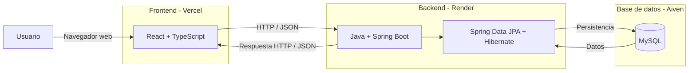

# Arquitectura del sistema

Alquify utilizará una arquitectura web basada en la separación entre frontend, backend y base de datos.

Esta organización permitirá separar la interfaz de usuario, la lógica de negocio y la persistencia de la información, manteniendo responsabilidades claramente diferenciadas.

## Diagrama de arquitectura



## Frontend

El frontend será desarrollado utilizando **React y TypeScript**.

Será responsable de la interfaz mediante la cual el usuario interactuará con Alquify.

Entre sus principales responsabilidades se encontrarán:

- Mostrar las diferentes pantallas de la aplicación.
- Permitir al usuario ingresar y consultar información.
- Enviar solicitudes al backend.
- Mostrar los datos y respuestas recibidos desde el backend.
- Facilitar la navegación entre los diferentes módulos del sistema.

El frontend no será responsable de aplicar las reglas de negocio críticas ni de acceder directamente a la base de datos.

## Backend

El backend será desarrollado utilizando **Java y Spring Boot**.

Será responsable de procesar las solicitudes provenientes del frontend y concentrará la lógica principal del sistema.

Entre sus responsabilidades se encontrarán:

- Exponer los servicios necesarios mediante una API REST.
- Procesar las solicitudes realizadas por el frontend.
- Aplicar las reglas de negocio.
- Validar la información recibida.
- Controlar que cada usuario acceda únicamente a su propia información.
- Gestionar las operaciones relacionadas con propiedades, clientes, huéspedes, reservas y pagos.
- Comunicarse con la capa de persistencia.

## Persistencia

Para la persistencia de los datos se utilizarán **Spring Data JPA y Hibernate**.

Esta capa permitirá realizar las operaciones necesarias sobre la información almacenada sin que el frontend tenga acceso directo a la base de datos.

Será utilizada por el backend para consultar, registrar, modificar y eliminar o desactivar información según corresponda.

## Base de datos

La información de Alquify será almacenada en una base de datos relacional **MySQL**.

La base de datos almacenará la información correspondiente a:

- Usuarios.
- Propiedades.
- Clientes.
- Huéspedes.
- Reservas.
- Pagos.
- Asociaciones entre reservas y huéspedes.

Su estructura estará definida de acuerdo con el esquema relacional documentado para el proyecto.

## Comunicación entre frontend y backend

La comunicación entre el frontend y el backend se realizará mediante una **API REST**.

Las solicitudes serán realizadas mediante HTTP y el intercambio de información utilizará principalmente el formato JSON.

El flujo general será:

1. El usuario realiza una acción desde la interfaz.
2. El frontend envía una solicitud HTTP al backend.
3. El backend recibe y valida la solicitud.
4. Se aplican las reglas de negocio correspondientes.
5. Si es necesario, el backend consulta o modifica información mediante la capa de persistencia.
6. El backend devuelve una respuesta al frontend.
7. El frontend actualiza la interfaz con la información recibida.

## Despliegue

La aplicación utilizará servicios independientes para desplegar cada componente:

| Componente | Tecnología | Despliegue |
|---|---|---|
| Frontend | React + TypeScript | Vercel |
| Backend | Java + Spring Boot | Render |
| Base de datos | MySQL | Aiven |

Esta separación permite desplegar cada componente de acuerdo con sus necesidades manteniendo la comunicación mediante la API REST.

## Estructura general del repositorio

El proyecto utilizará un único repositorio organizado inicialmente de la siguiente manera:

```text
alquify/
├── frontend/
├── backend/
├── database/
├── docs/
└── README.md
```

### `frontend/`

Contendrá el código correspondiente a la aplicación desarrollada con React y TypeScript.

### `backend/`

Contendrá el código correspondiente a la API REST desarrollada con Java y Spring Boot.

### `database/`

Contendrá los recursos relacionados con la estructura de la base de datos que resulte necesario versionar.

### `docs/`

Contendrá la documentación del proyecto en formatos de texto versionables mediante Git, incluyendo el análisis de requerimientos, modelo de datos, reglas de negocio, módulos y arquitectura.

### `README.md`

Contendrá la presentación general del proyecto y permitirá acceder a las diferentes secciones de documentación.

## Resumen de la arquitectura

El flujo principal de Alquify puede resumirse de la siguiente manera:

`Usuario → React + TypeScript → API REST / Spring Boot → JPA / Hibernate → MySQL`

Esta arquitectura mantiene separadas la presentación, la lógica de negocio y la persistencia de datos, y será la base utilizada durante la implementación del sistema.
