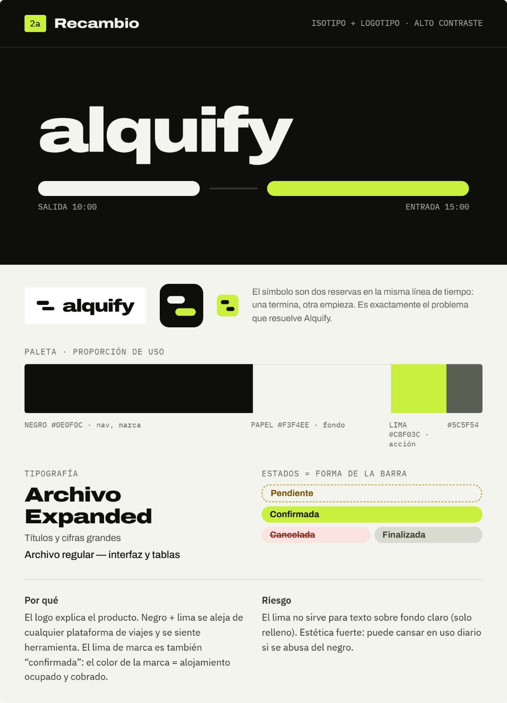
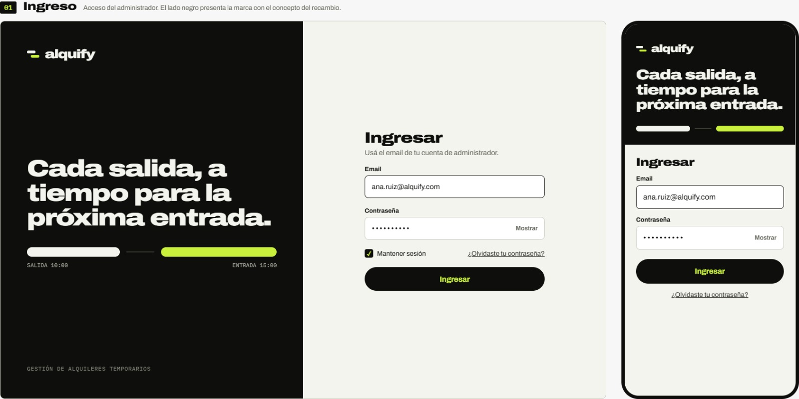
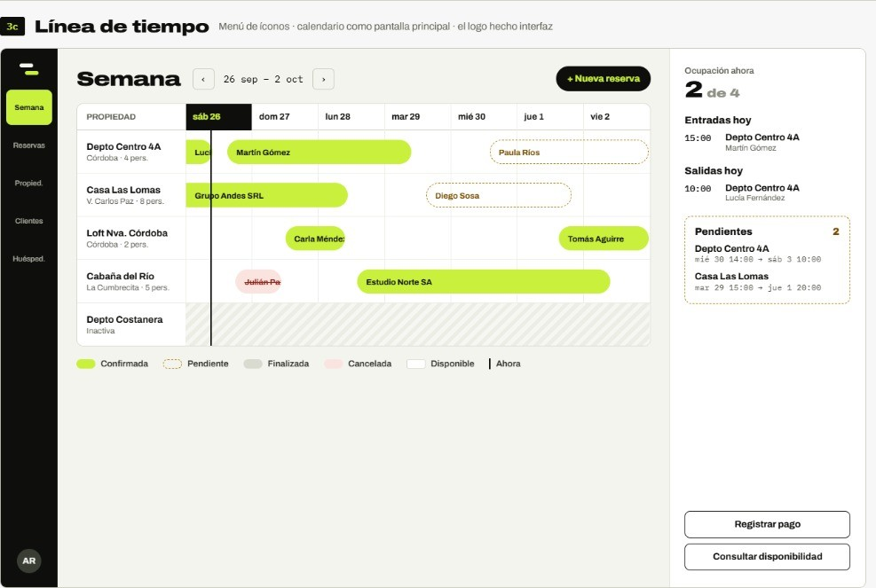
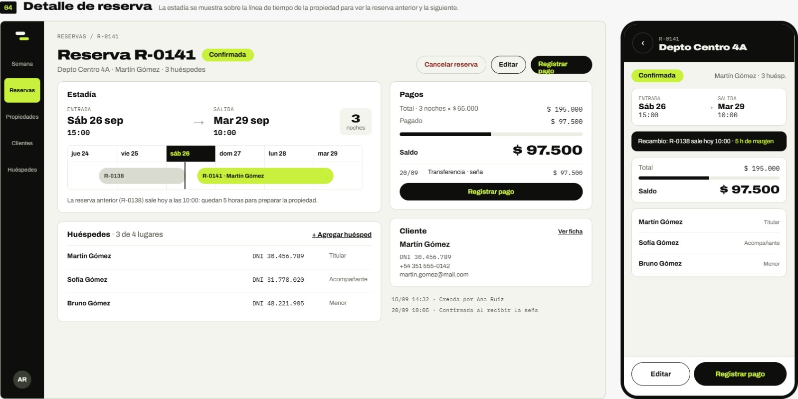
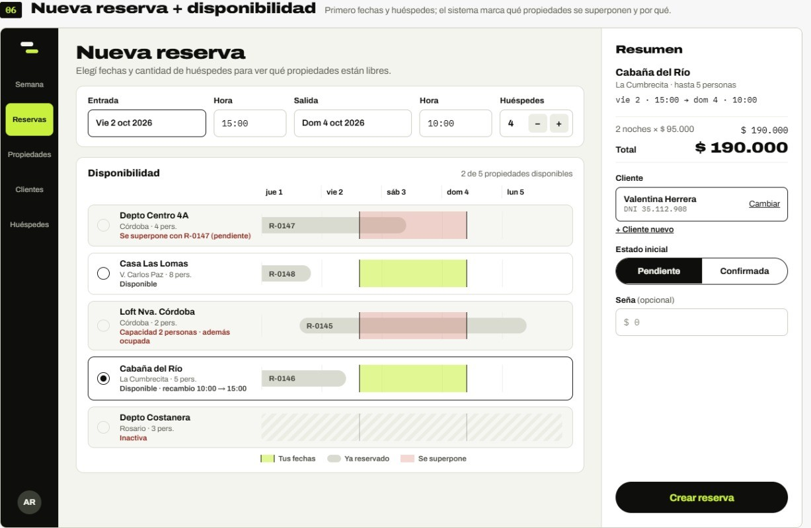
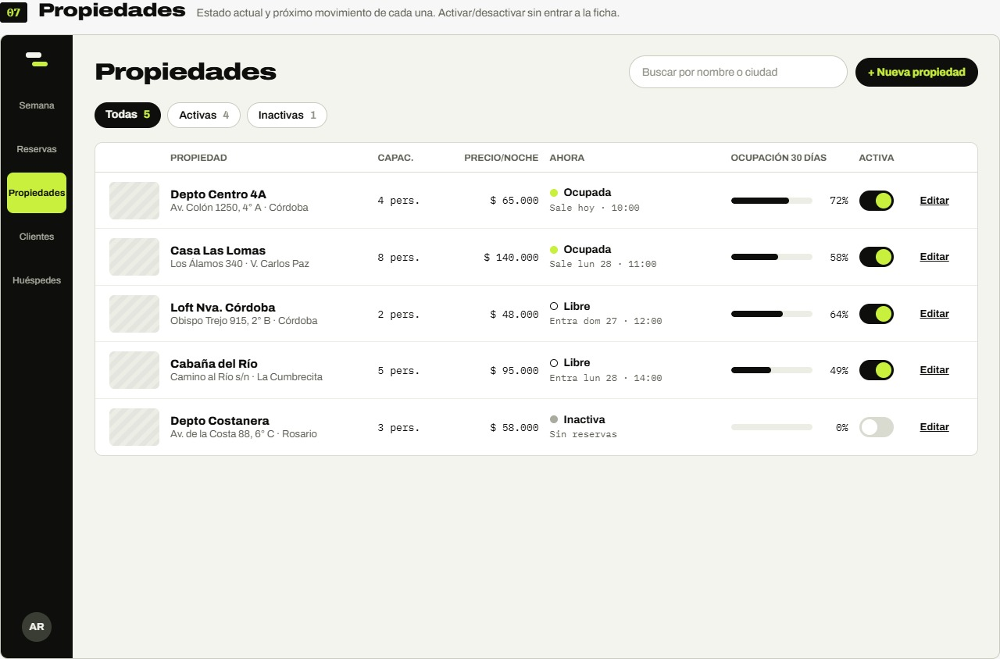
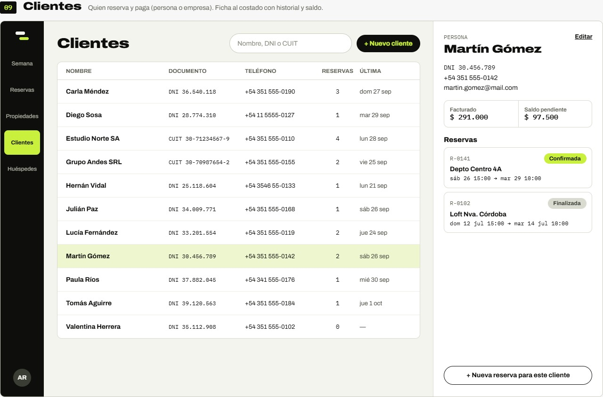
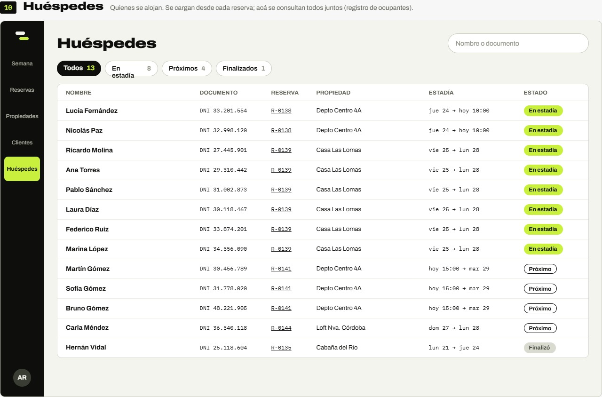
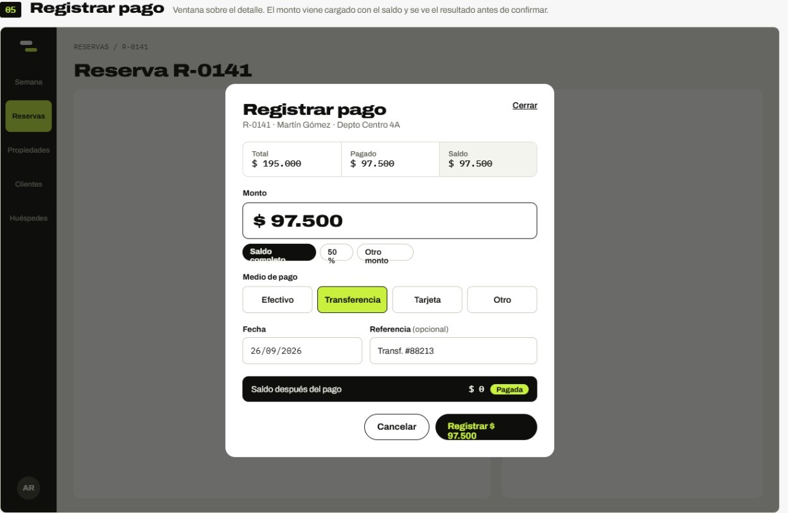

# Diseño inicial de interfaces

Como parte de la etapa de diseño de Alquify se desarrollaron una serie de mockups con el objetivo de definir una propuesta inicial para la identidad visual, navegación y organización de las principales pantallas del sistema.

Estos diseños permiten anticipar la experiencia de uso antes de comenzar con la implementación del frontend. Se consideran una propuesta inicial y podrán ser modificados durante el desarrollo.

Los mockups contemplan tanto la visualización de escritorio como algunas adaptaciones para dispositivos móviles.

---

## Identidad visual

Se definió una propuesta inicial de identidad visual para Alquify basada en una interfaz de alto contraste y una estética orientada a una herramienta administrativa.

La identidad utiliza como elementos principales:

- Logotipo e isotipo de Alquify.
- Negro como color principal para navegación y elementos de marca.
- Fondo claro para las áreas de trabajo.
- Color lima como color de acción y elemento de identificación visual.
- Tipografía Archivo para títulos, información e interfaz.
- Representación visual de los diferentes estados de las reservas.

El concepto gráfico del isotipo representa dos reservas sobre una misma línea de tiempo: una finaliza y otra comienza. De esta manera, la identidad visual se relaciona con uno de los principales problemas que busca resolver Alquify: la administración de la ocupación y el recambio entre reservas.

---

## Navegación general

Para la versión de escritorio se propone una barra de navegación lateral que permita acceder rápidamente a las principales áreas de la aplicación.

Entre los accesos principales se encuentran:

- Semana.
- Reservas.
- Propiedades.
- Clientes.
- Huéspedes.

La opción seleccionada se destaca visualmente utilizando el color principal de la identidad.

En las propuestas para dispositivos móviles, la navegación se adapta al espacio disponible mediante controles simplificados y navegación inferior cuando corresponde.

---

## Inicio de sesión

La pantalla de ingreso permite al usuario autenticarse para acceder a la administración de sus alquileres.

La propuesta contiene:

- Identidad visual de Alquify.
- Correo electrónico.
- Contraseña.
- Opción para mantener la sesión.
- Acción para ingresar al sistema.
- Acceso a recuperación de contraseña.

En escritorio se utiliza una composición dividida entre la identidad de Alquify y el formulario de acceso. En dispositivos móviles ambos elementos se reorganizan verticalmente.

---

## Vista semanal

La vista semanal se plantea como una de las principales pantallas de trabajo de Alquify.

Su objetivo es representar visualmente la ocupación de las propiedades mediante una línea de tiempo.

Cada fila corresponde a una propiedad y las reservas se representan mediante barras ubicadas según su período de ocupación.

La interfaz permite distinguir visualmente reservas:

- Confirmadas.
- Pendientes.
- Finalizadas.
- Canceladas.

También se indica el momento actual y los espacios disponibles entre reservas.

La vista complementa esta información con próximas entradas, próximas salidas y reservas pendientes.

En dispositivos móviles se utiliza una representación simplificada de la ocupación de cada propiedad para el día seleccionado.

---

## Reservas

La sección de reservas permite consultar y administrar las reservas registradas en el sistema.

Desde esta sección el usuario podrá acceder a la información relacionada con cada estadía y posteriormente realizar las operaciones correspondientes, como modificarla, cancelarla o registrar pagos.

La propuesta de diseño busca que el estado de cada reserva pueda identificarse rápidamente y que la información relacionada con fechas, propiedad, cliente y huéspedes se encuentre organizada de forma clara.

---

## Nueva reserva y consulta de disponibilidad

La creación de una reserva integra la consulta de disponibilidad dentro del mismo flujo.

Inicialmente se seleccionan:

- Fecha y hora de entrada.
- Fecha y hora de salida.
- Cantidad de huéspedes.

A partir de esta información, la interfaz muestra las propiedades disponibles y aquellas que no pueden utilizarse.

Cuando una propiedad no se encuentra disponible, se informa el motivo, por ejemplo:

- Superposición con otra reserva.
- Capacidad insuficiente.
- Propiedad inactiva.

Una vez seleccionada una propiedad, se presenta un resumen de la reserva junto con el cliente, estado inicial e importe correspondiente.

Esta propuesta busca que el usuario pueda detectar conflictos antes de confirmar la operación.

---

## Propiedades

La sección de propiedades permite consultar los inmuebles administrados por el usuario.

La propuesta utiliza una tabla para mostrar de manera compacta información relevante de cada propiedad, incluyendo:

- Nombre.
- Ubicación.
- Capacidad.
- Estado actual.
- Ocupación.
- Estado activa o inactiva.

También se incorporan herramientas de búsqueda, filtros y acceso al registro de una nueva propiedad.

El objetivo de esta pantalla es proporcionar una visión general del estado de las propiedades sin necesidad de ingresar individualmente al detalle de cada una.

---

## Clientes

La sección de clientes permite consultar la cartera de clientes correspondiente al usuario.

La interfaz presenta un listado con información básica, como:

- Nombre o razón social.
- Documento o CUIT.
- Teléfono.
- Cantidad de reservas.
- Última reserva.

La búsqueda podrá realizarse utilizando datos como nombre, DNI o CUIT.

Al seleccionar un cliente se presenta información adicional y su historial de reservas.

La propuesta contempla tanto clientes particulares como empresas, de acuerdo con el modelo definido para Alquify.

---

## Huéspedes

La sección de huéspedes permite consultar las personas asociadas a las distintas reservas.

El listado presenta información como:

- Nombre.
- Documento.
- Reserva.
- Propiedad.
- Período de estadía.
- Estado de la estadía.

La propuesta también incorpora filtros para diferenciar huéspedes actualmente alojados, próximos huéspedes y estadías finalizadas.

Esta pantalla funciona como un registro general de ocupantes y complementa la información disponible dentro de cada reserva.

---

## Registro de pagos

El registro de pagos se plantea como una acción asociada al detalle de una reserva.

Antes de registrar un pago, la interfaz muestra:

- Importe total de la reserva.
- Total abonado.
- Saldo pendiente.

El usuario podrá indicar:

- Monto.
- Medio de pago.
- Fecha.
- Referencia u observación cuando corresponda.

La interfaz muestra el saldo resultante antes de confirmar la operación.

Alquify únicamente registrará pagos realizados por medios externos. La aplicación no procesará directamente las transacciones.

---

## Adaptación a dispositivos móviles

Aunque Alquify estará orientado principalmente al uso desde escritorio, los diseños iniciales contemplan la adaptación de las principales operaciones a pantallas de menor tamaño.

En los mockups se exploraron versiones móviles para funcionalidades como:

- Inicio de sesión.
- Consulta de ocupación.
- Detalle de reserva.
- Creación de reservas.
- Registro de pagos.

La información se reorganiza priorizando las acciones y datos más relevantes para cada operación.

---

## Estado del diseño

Los mockups representan una propuesta inicial de UX/UI para Alquify y forman parte de la etapa de diseño del proyecto.

Su objetivo es definir previamente:

- La organización general de las pantallas.
- La navegación entre módulos.
- La jerarquía de la información.
- La identidad visual.
- La representación de reservas y disponibilidad.
- La adaptación inicial a diferentes tamaños de pantalla.

Estos diseños no representan necesariamente la versión definitiva de la aplicación y podrán ser ajustados durante la implementación en función de las necesidades que surjan durante el desarrollo.
